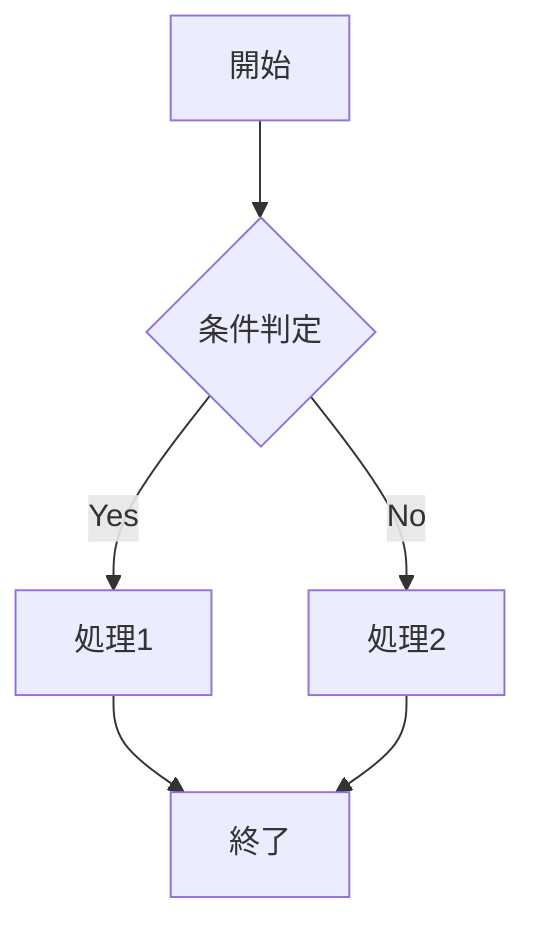

# サンプルドキュメント

このドキュメントは、md-specgenの基本的な使い方を示すサンプルです。

## 概要

md-specgenは、MarkdownファイルをHTMLやPDFに変換するツールです。以下の特徴があります:

- Markdownからの美しいHTML生成
- NumPy風のスタイリング
- PDF出力サポート
- 画像のBase64埋め込み
- Mermaidダイアグラムのサポート

## Markdownの基本記法

### 見出し

見出しは `#` で表現します。レベル1から6まで対応しています。

### 段落

段落は空行で区切ります。
これは同じ段落内の文章です。

これは新しい段落です。

### リスト

#### 順序なしリスト

- アイテム1
- アイテム2
  - サブアイテム2.1
  - サブアイテム2.2
- アイテム3

#### 順序付きリスト

1. 最初のステップ
2. 次のステップ
3. 最後のステップ

### 強調

- **太字** または __太字__
- *イタリック* または _イタリック_
- ~~取り消し線~~

### コードブロック

インラインコード: `const x = 1;`

コードブロック:

```javascript
function greet(name) {
  return `Hello, ${name}!`;
}

console.log(greet('World'));
```

```python
def factorial(n):
    if n <= 1:
        return 1
    return n * factorial(n - 1)

print(factorial(5))  # 120
```

### 引用

> これは引用文です。
> 複数行にわたることもできます。
>
> 引用のネストも可能です。

### テーブル

| 項目 | 説明 | サポート |
|------|------|----------|
| HTML出力 | Markdownを美しいHTMLに変換 | ✓ |
| PDF出力 | HTMLからPDFを生成 | ✓ |
| Mermaid | ダイアグラムの自動画像化 | ✓ |
| LLM統合 | AI機能による品質向上 | ✓ |

### リンク

[md-specgen on GitHub](https://github.com/takemi-ohama/md-specgen)

### 画像


画像はBase64で埋め込まれるため、単一のHTMLファイルとして配布できます。

### 水平線

---

## Mermaid図

以下はMermaid記法で書かれたフローチャートの例です:



## まとめ

md-specgenを使用すると、このようなMarkdownドキュメントを:

1. 美しいHTMLに変換
2. PDF形式で出力
3. 画像を埋め込んで単一ファイル化
4. Mermaid図を自動画像化

することができます。

詳細は[README](../../../README.md)をご覧ください。
