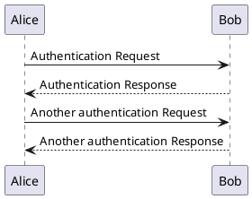
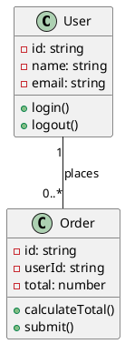
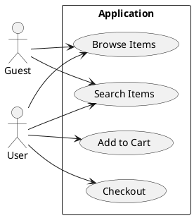
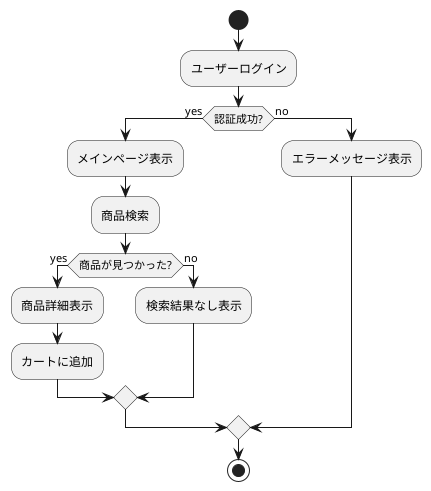
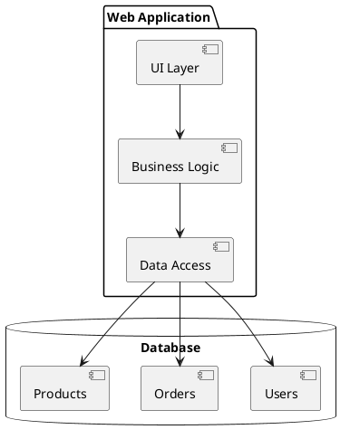
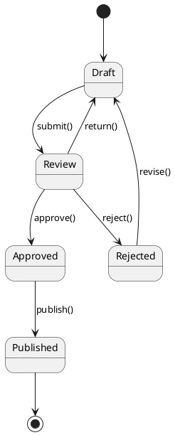

# PlantUML サンプル

このドキュメントはPlantUMLの各種図のサンプルを含みます。

## シーケンス図

```plantuml
@startuml
Alice -> Bob: Authentication Request
Bob --> Alice: Authentication Response

Alice -> Bob: Another authentication Request
Alice <-- Bob: Another authentication Response
@enduml
```

## クラス図

```plantuml
@startuml
class User {
  - id: string
  - name: string
  - email: string
  + login()
  + logout()
}

class Order {
  - id: string
  - userId: string
  - total: number
  + calculateTotal()
  + submit()
}

User "1" -- "0..*" Order : places
@enduml
```

## ユースケース図

```plantuml
@startuml
left to right direction
actor Guest as g
actor User as u
rectangle Application {
  usecase "Browse Items" as UC1
  usecase "Search Items" as UC2
  usecase "Add to Cart" as UC3
  usecase "Checkout" as UC4
}

g --> UC1
g --> UC2
u --> UC1
u --> UC2
u --> UC3
u --> UC4
@enduml
```

## アクティビティ図

```plantuml
@startuml
start
:ユーザーログイン;
if (認証成功?) then (yes)
  :メインページ表示;
  :商品検索;
  if (商品が見つかった?) then (yes)
    :商品詳細表示;
    :カートに追加;
  else (no)
    :検索結果なし表示;
  endif
else (no)
  :エラーメッセージ表示;
endif
stop
@enduml
```

## コンポーネント図

```plantuml
@startuml
package "Web Application" {
  [UI Layer] as UI
  [Business Logic] as BL
  [Data Access] as DA
}

database "Database" {
  [Users]
  [Orders]
  [Products]
}

UI --> BL
BL --> DA
DA --> [Users]
DA --> [Orders]
DA --> [Products]
@enduml
```

## ステートマシン図

```plantuml
@startuml
[*] --> Draft

Draft --> Review : submit()
Review --> Approved : approve()
Review --> Rejected : reject()
Review --> Draft : return()

Approved --> Published : publish()
Rejected --> Draft : revise()

Published --> [*]
@enduml
```
