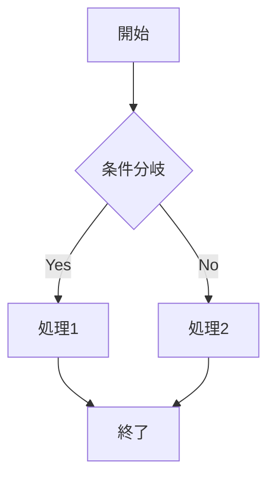
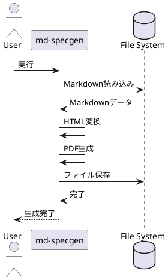
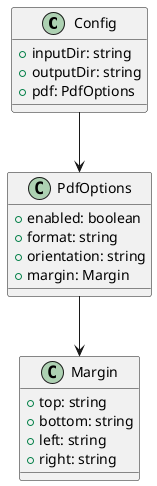

# E2Eテスト: 全機能検証

このドキュメントは、md-specgenのすべての機能をテストするためのサンプルです。

## 基本的なMarkdown要素

### テキストスタイル

これは**太字**テキストです。これは*斜体*テキストです。これは~~取り消し線~~テキストです。

### リスト

#### 順序なしリスト
- 項目1
- 項目2
  - サブ項目2.1
  - サブ項目2.2
- 項目3

#### 順序付きリスト
1. 最初の項目
2. 2番目の項目
3. 3番目の項目

### コードブロック

```javascript
function hello(name) {
  console.log(`Hello, ${name}!`);
}

hello('World');
```

### テーブル

| 機能 | 実装済み | バージョン |
|-----|---------|-----------|
| PDF生成 | ✅ | v1.0.0 |
| PlantUML | ✅ | v1.5.0 |
| Watch | ✅ | v2.0.0 |

## カスタムコンテナ

PLAN01.mdで実装したカスタムコンテナ機能をテストします。

:::warning 警告
これは警告コンテナです。重要な注意事項を表示します。
:::

:::info 情報
これは情報コンテナです。追加の情報を提供します。
:::

:::tip ヒント
これはヒントコンテナです。便利なヒントを提供します。
:::

:::danger 危険
これは危険コンテナです。危険な操作について警告します。
:::

:::note 注意
これは注意コンテナです。メモや注意事項を表示します。
:::

:::success 成功
これは成功コンテナです。成功メッセージを表示します。
:::

## Mermaidダイアグラム

PLAN01.md実装前から存在していたMermaidサポートをテストします。



### フローチャート例


## PlantUMLダイアグラム

PLAN01.md Phase 4で実装したPlantUMLサポートをテストします。



### クラス図



## リンクと引用

### 外部リンク
[GitHub](https://github.com/takemi-ohama/md-specgen)

### 引用
> これは引用ブロックです。
> PLAN01.mdの実装により、多くの機能が追加されました。

## 実装フェーズまとめ

### Phase 1: PDF単体出力バグ修正
一時ディレクトリを使用した安全な生成フローに変更しました。

### Phase 2: 基本PDF機能拡張
- ページ向き設定（portrait/landscape）
- マージン詳細設定
- ヘッダー・フッターカスタマイズ

### Phase 3: Markdown機能強化
- `markdown-it`への移行
- カスタムコンテナサポート
- ファイルインクルード機能
- 自動見出しアンカー

### Phase 4: PlantUMLサポート
- PlantUML図の自動変換
- PNG/SVG出力対応

### Phase 5: Watchモード
- ファイル変更監視
- 自動再生成
- グレースフルシャットダウン

## 結論

すべてのフェーズが正常に実装され、md-specgenは強力なドキュメント生成ツールになりました。
