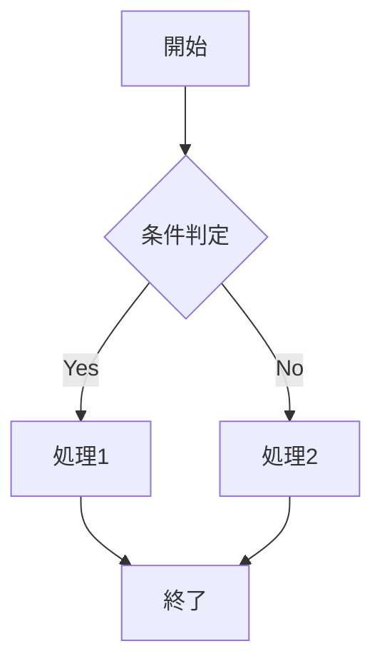
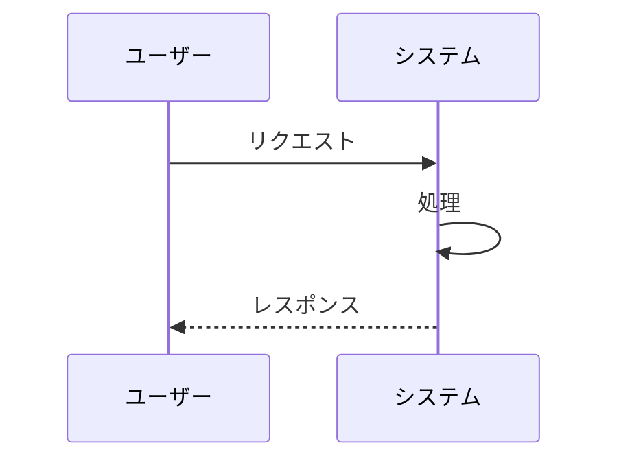

# Mermaid図入りドキュメント

このドキュメントにはMermaid図が含まれています。

## フローチャート

```mermaid
graph TD
    A[開始] --> B{条件判定}
    B -->|Yes| C[処理1]
    B -->|No| D[処理2]
    C --> E[終了]
    D --> E
```

## シーケンス図

```mermaid
sequenceDiagram
    participant A as ユーザー
    participant B as システム
    A->>B: リクエスト
    B->>B: 処理
    B-->>A: レスポンス
```

## まとめ

Mermaid図を使うことで、視覚的にわかりやすいドキュメントが作成できます。
